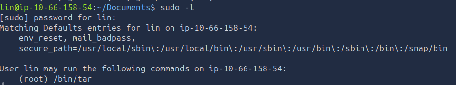

# Bounty Hacker Penetration Test Report

## Cover Page

Bounty Hacker - Security Assessment Report

Author: PhaseSpider
Date: 2026-06-21

Methodology:

* PTES
* MITRE ATT&CK

Classification:
Educational / TryHackMe Lab

---

# Executive Summary

A penetration test was conducted against the Bounty Hacker target machine.

The assessment identified multiple weaknesses that allowed an attacker to:

* Access sensitive information through anonymous FTP access
* Obtain valid credentials
* Gain remote access via SSH
* Escalate privileges to root
* Fully compromise the target host

Risk Rating:
Critical

---

# Scope

Target:

10.66.158.54

Objective:

* Obtain User Flag
* Obtain Root Flag

Methodology:

* Information Gathering
* Enumeration
* Exploitation
* Post Exploitation
* Privilege Escalation

---

# Attack Path Overview

Anonymous FTP
↓
Sensitive Files Disclosure
↓
Username Discovery
↓
Password Wordlist Discovery
↓
SSH Credential Attack
↓
Initial Access
↓
Sudo Misconfiguration
↓
Privilege Escalation
↓
Root Access

---

# Finding 1

Anonymous FTP Access Enabled

Severity:
Medium

Description:
The FTP service allowed anonymous authentication.

Evidence:
![\[screenshot\]](screenshots/03_ftp.png)

Impact:
Unauthorized users may access internal files.

MITRE ATT&CK:
T1133

Recommendation:
Disable anonymous FTP access.

---

# Finding 2

Credential Exposure Through FTP Files

Severity:
High

Description:
Files accessible through FTP revealed usernames and password candidates.

Impact:
Credential attacks become significantly easier.

MITRE ATT&CK:
T1552

Recommendation:
Remove sensitive files from publicly accessible services.

---

# Finding 3

SSH Credential Compromise

Severity:
High

Description:
Recovered password list allowed successful authentication via SSH.

Evidence:
![\[screenshot\]](screenshots/05_ssh.png)

MITRE ATT&CK:
T1110
T1021.004

Recommendation:
Implement strong password policies and MFA.

---

# Finding 4

Privilege Escalation via Sudo Misconfiguration

Severity:
Critical

Description:
The user lin was allowed to execute tar as root.

Evidence:

MITRE ATT&CK:
T1548

Recommendation:
Restrict sudo permissions to required administrative functions only.

---

# Post Exploitation

User Flag Retrieved

THM{CR1M3_SyNd1C4T3}

Root Flag Retrieved

THM{80UN7Y_h4cK3r}

---

# MITRE ATT&CK Mapping

| Action               | Technique |
| -------------------- | --------- |
| FTP Enumeration      | T1046     |
| Anonymous FTP Access | T1133     |
| Password Attack      | T1110     |
| SSH Access           | T1021.004 |
| Privilege Escalation | T1548     |

---

# Conclusion

The target machine was fully compromised through a chain of weaknesses.

The attack required no software vulnerabilities and relied entirely on exposed services, poor credential hygiene, and privilege misconfigurations.

This demonstrates how small configuration weaknesses can combine to produce complete system compromise.
